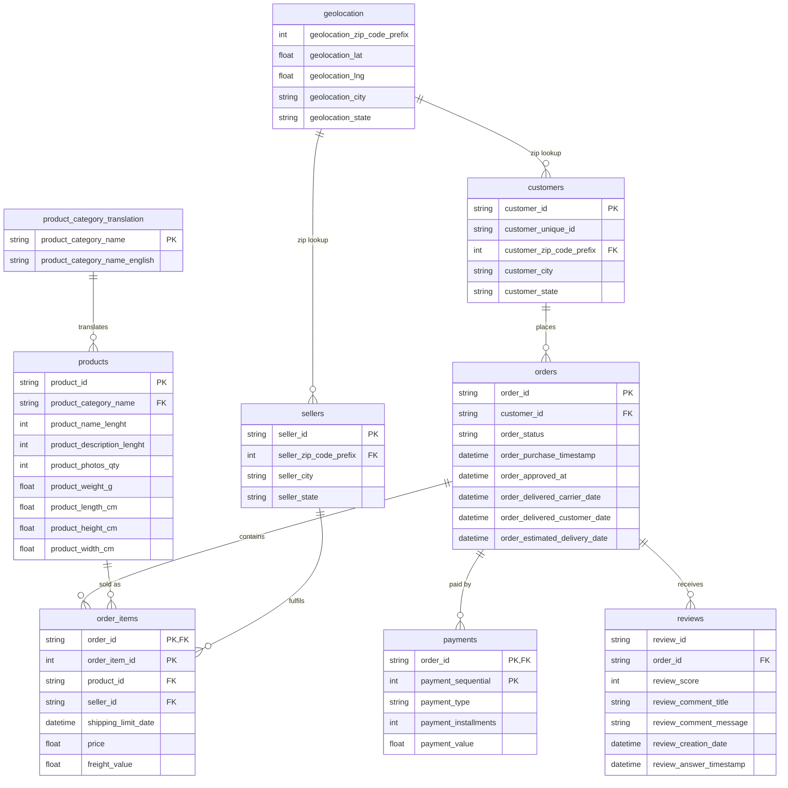

# MarketplacePulse AI — ER Diagram (Olist Dataset)

Phase 1 deliverable. Shows the 9 Olist tables, their keys, and how they connect.
Renders as a picture on GitHub. In VS Code, use a Mermaid preview extension.

## Diagram

## Relationships and what we verified in the notebook

| Parent | Child | Join key | Verified in Phase 1 |
|---|---|---|---|
| customers | orders | customer_id | FK check clean (0 orphans) |
| orders | order_items | order_id | FK check clean (0 orphans) |
| orders | payments | order_id | FK clean; 1:N confirmed (99,440 orders, 103,886 rows); 1 order has no payment |
| orders | reviews | order_id | FK clean; 1:N confirmed (98,673 orders, 99,224 rows); ~768 orders have no review |
| products | order_items | product_id | FK check clean (0 orphans) |
| sellers | order_items | seller_id | FK check clean (0 orphans) |
| product_category_translation | products | product_category_name | 2 categories missing from translation; 610 products have no category |
| geolocation | customers | zip code prefix | Soft link only; 278 customer zips not found in geolocation |
| geolocation | sellers | zip code prefix | Soft link only; 7 seller zips not found in geolocation |

## Grain (what one row means)

| Table | One row = | Rows |
|---|---|---|
| customers | one customer_id | 99,441 |
| orders | one order | 99,441 |
| order_items | one item within an order (order_id + order_item_id) | 112,650 |
| payments | one payment entry for an order (order_id + payment_sequential) | 103,886 |
| reviews | one review, an order can have more than one | 99,224 |
| products | one product | 32,951 |
| sellers | one seller | 3,095 |
| geolocation | one coordinate point, many per zip prefix (no key) | 1,000,163 |
| product_category_translation | one category name | 71 |

## Notes and open points

- **Geolocation is not keyed.** It has 19,015 unique zip prefixes over about 1M rows, so it must be aggregated per zip prefix before joining to customers or sellers, otherwise rows multiply.
- **customer_id vs customer_unique_id.** In the Olist documentation, customer_id is assigned per order and customer_unique_id identifies the actual person. Not yet verified in our notebook. Check this before building customer recency and frequency features in Phase 4.
- **review_id uniqueness** has not been verified yet, so it is not marked as a primary key in the diagram.
- Primary keys marked above follow the Olist schema. Uniqueness was directly confirmed for orders.order_id (99,441 unique values) and through the clean FK checks.
